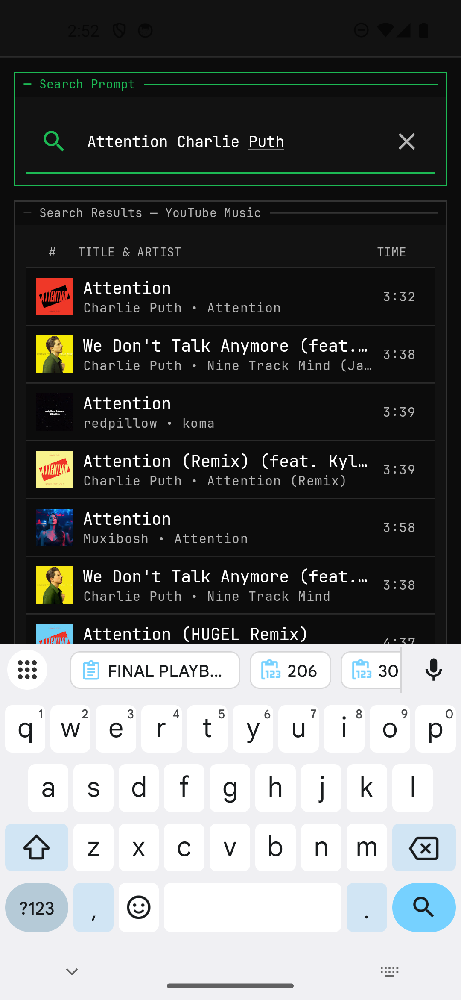
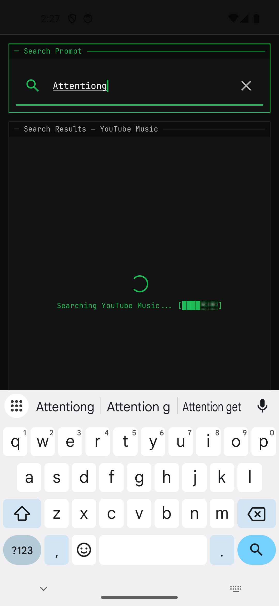
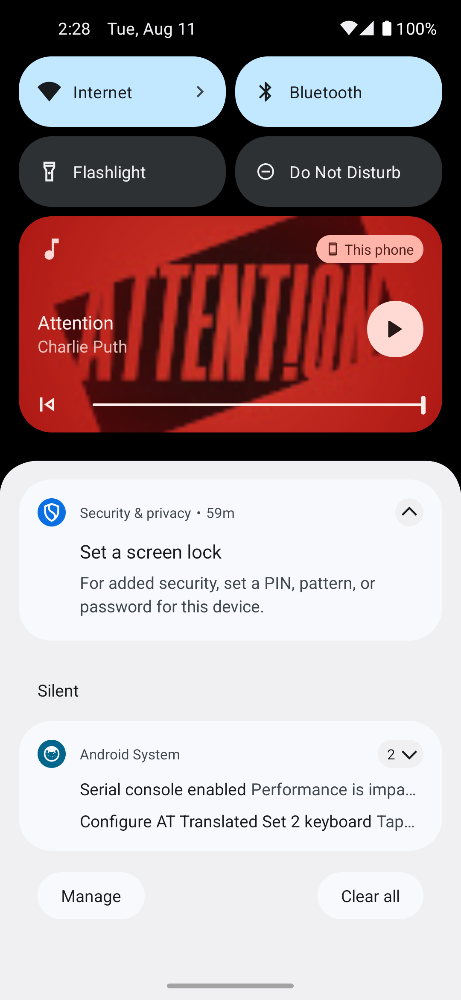

# CLIBeats

> A free, open-source Android music player with a terminal-inspired interface and direct on-device music streaming.

[](https://developer.android.com/)
[](https://kotlinlang.org/)
[](https://developer.android.com/compose)
[](LICENSE)

CLIBeats is an experimental open-source Android music player designed around three principles:

- **No advertisements**
- **No user accounts or application-side user tracking**
- **A fast, keyboard-terminal-inspired interface** rather than a conventional streaming-app design

It combines a dense monochrome UI with local persistence, background playback, playlists, queue management, and a provider-agnostic music architecture.

---

## Screenshots

<p align="center">
  
  
  
  
</p>

---

## Features

### Playback
- Direct on-device stream resolution
- Background playback
- Media notification controls
- Play / pause
- Seek
- Next / previous
- Queue management
- Media3 / ExoPlayer playback engine

### Music Discovery
- Music search
- Track metadata
- Album artwork
- Artist and album information
- Provider-independent track model

### Library
- Local playlists
- Queue persistence
- Playback history
- Cached metadata
- Local music support
- Portable playlist export/import

### Interface
- Terminal-inspired visual language
- Monospaced typography
- Dense information layout
- Dark monochrome palette
- Flat surfaces
- Minimal animation
- Adaptive Material 3 UI

---

## Architecture

CLIBeats uses a layered architecture designed to keep the application independent from any individual music provider.

```text
┌──────────────────────────────────────────────┐
│                 Presentation                 │
│                                              │
│     Jetpack Compose · ViewModels · UI        │
└──────────────────────┬───────────────────────┘
                       │
┌──────────────────────▼───────────────────────┐
│                   Domain                     │
│                                              │
│  MusicProvider · Track · Album · Playlist    │
└──────────────────────┬───────────────────────┘
                       │
┌──────────────────────▼───────────────────────┐
│                    Data                      │
│                                              │
│  Providers · Repositories · Room · Cache     │
└──────────────────────┬───────────────────────┘
                       │
              ┌────────▼────────┐
              │ Playback Engine │
              │ Media3/ExoPlayer│
              └─────────────────┘
```

### Provider Abstraction

Music sources implement the common `MusicProvider` contract.

```text
MusicProvider
├── search()
├── trending()
├── getTrack()
├── stream()
├── playlists()
└── queue()
```

This keeps provider-specific extraction and API logic isolated from the rest of the application.

---

## Technology

| Component | Technology |
|---|---|
| Language | Kotlin |
| UI | Jetpack Compose |
| Design | Material 3 |
| Architecture | MVVM + Clean Architecture |
| Dependency Injection | Hilt / Dagger |
| Database | Room |
| Preferences | DataStore |
| Secure Storage | Android Keystore |
| Playback | AndroidX Media3 / ExoPlayer |
| Networking | Retrofit + OkHttp |
| Testing | JUnit, Mockito, Paparazzi |
| Static Analysis | Detekt, ktlint, Android Lint |
| Build | Gradle + Kotlin DSL |

---

## Requirements

* Android 8.0 / API 26 or newer
* JDK 17
* Android SDK 34
* Gradle 8.5+

---

## Build From Source

Clone the repository:

```bash
git clone https://github.com/Omprakash-p06/clibeats.git
cd clibeats
```

Run unit tests:

```powershell
.\gradlew.bat testDebugUnitTest
```

Run screenshot tests:

```powershell
.\gradlew.bat verifyPaparazziDebug
```

Run static analysis:

```powershell
.\gradlew.bat ktlintCheck
.\gradlew.bat detekt
```

Build a debug APK:

```powershell
.\gradlew.bat assembleDebug
```

The generated APK will be located under:

```text
app/build/outputs/apk/debug/
```

---

## Development

Run the complete local verification suite:

```powershell
.\gradlew.bat testDebugUnitTest
.\gradlew.bat verifyPaparazziDebug
.\gradlew.bat ktlintCheck
.\gradlew.bat detekt
.\gradlew.bat lintDebug
.\gradlew.bat assembleDebug
```

For release verification:

```powershell
.\gradlew.bat assembleRelease
```

---

## Project Structure

```text
app/
├── src/main/java/com/clibeats/
│   ├── data/
│   │   ├── provider/
│   │   ├── repository/
│   │   ├── database/
│   │   └── cache/
│   │
│   ├── domain/
│   │   ├── model/
│   │   └── provider/
│   │
│   ├── playback/
│   ├── ui/
│   └── di/
│
├── src/test/
└── src/main/
```

Detailed architecture documentation is maintained separately in:

```text
docs/
├── adr/
└── architecture/
```

---

## Quality

CLIBeats uses automated checks for:

* Compilation
* Unit tests
* Android Lint
* Detekt
* ktlint
* Paparazzi screenshot regression tests
* Debug APK builds
* Release APK builds
* CI verification

The current verified playback implementation has been tested with:

* Attention — Charlie Puth
* Blinding Lights — The Weeknd
* Believer — Imagine Dragons
* Wonderwall — Oasis
* Tum Hi Ho — Arijit Singh
* Kesariya — Arijit Singh

The verified runtime path performs stream resolution directly on the Android device and does not require a separate application backend.

---

## Current Status

**Functional prototype / active development**

The core playback pipeline is operational, but CLIBeats should still be considered an evolving project.

Music provider implementations depend on third-party services and extraction mechanisms that can change independently of CLIBeats.

Provider-specific failures may therefore require future updates.

---

## Privacy

CLIBeats is designed around local-first operation.

The application does not require a CLIBeats account or a CLIBeats-owned backend to operate.

Library data, playlists, queue state, and playback history are stored locally on the device.

Third-party music providers may still receive network requests required to search for and retrieve music. Their own policies therefore apply independently of CLIBeats.

---

## Legal Notice

CLIBeats is an independent open-source software project.

It does not provide or host music files itself.

Music availability and access are determined by the configured music provider.

Users are responsible for complying with the terms of service, copyright laws, and other applicable laws in their jurisdiction when using third-party providers.

---

## Documentation

* [Architecture](docs/architecture/)
* [Architecture Decision Records](docs/adr/)
* [License](LICENSE)

---

## Contributing

Contributions are welcome.

Before submitting a pull request:

1. Keep provider-specific logic isolated from the domain layer.
2. Add or update tests for behavioral changes.
3. Run the local quality gates.
4. Keep UI changes consistent with the existing design system.
5. Do not introduce backend dependencies without an explicit architectural decision.

---

## License

CLIBeats is distributed under the MIT License.

See [LICENSE](LICENSE) for the complete license text.
