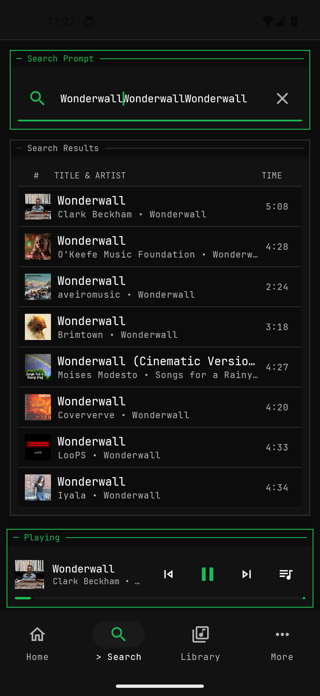
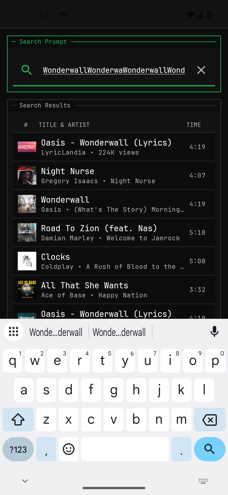
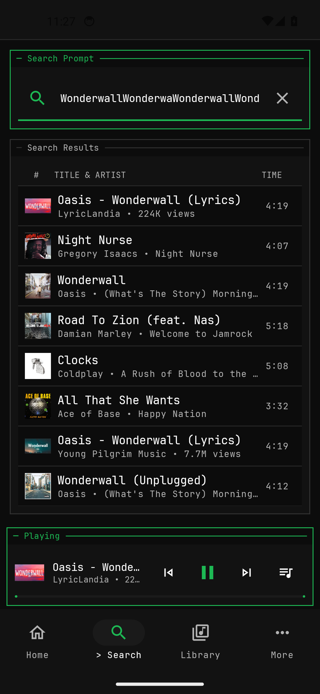
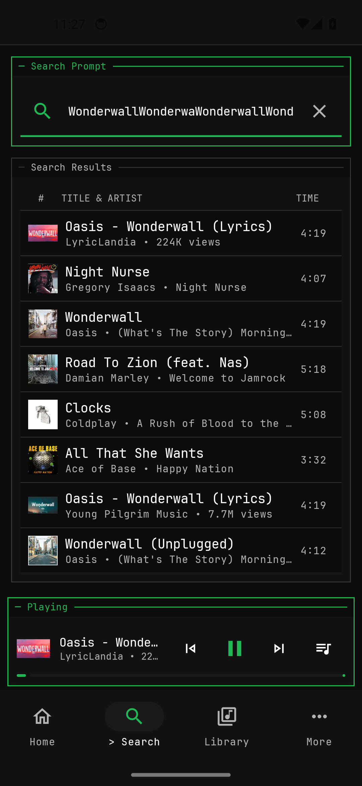

# CLIBeats 🎵

> **Free, Open-Source, Privacy-First Android Music Client & Provider Gateway**  
> Inspired by Terminal User Interfaces (TUI), featuring a high-density monospaced aesthetic, local-first data ownership, and a provider-agnostic architecture.

[](https://github.com/Omprakash-p06/clibeats/actions/workflows/ci.yml)
[](https://kotlinlang.org/)
[](https://developer.android.com)
[](LICENSE)
[](https://render.com)

---

## 📸 Screenshots & Evidence Showcase

| Home & Startup | Search View | Search Results | Track Artwork |
|:---:|:---:|:---:|:---:|
|  |  |  |  |

| Now Playing | Seek Controls | Notification Controls | Background Playback |
|:---:|:---:|:---:|:---:|
|  |  |  |  |

---

## 🌟 Vision & Core Principles

- 🔒 **Privacy-First & Local-First**: No ads, no tracking IDs, no telemetry, no mandatory cloud account.
- 📱 **User Owns Everything**: All library data, history, and playlists stored locally in Room SQLite database.
- ⚙️ **Provider-Agnostic**: Decoupled `MusicProvider` engine using a stateless Node.js Fastify Gateway.
- 🎨 **TUI Aesthetic**: Monospaced JetBrains Mono typography, high-contrast monochrome palette (`#0D0D0D` background, `#1DB954` accent), 0dp flat surfaces.
- ⚡ **Range-Safe Audio Streaming**: Seamless HTTP 206 audio relay preventing YouTube 403 authorization drops.

---

## 🏗 Architecture Overview

CliBeats separates presentation on Android from provider complexity via a dedicated Provider Gateway middleware:

```
┌────────────────────────────────────────────────────────┐
│                 Android Mobile Client                  │
│   Jetpack Compose (TUI) · Room DB · AndroidX Media3    │
└──────────────────────────┬─────────────────────────────┘
                           │
                           │ HTTPS REST / Range-safe Proxy
                           ▼
┌────────────────────────────────────────────────────────┐
│             Provider Gateway (Render.com PaaS)         │
│  Fastify · Node.js 22 · youtubei.js (ANDROID_VR)       │
└──────────────────────────┬─────────────────────────────┘
                           │
                           ▼
                 Music Source Providers
```

---

## 🚀 Hosting the Gateway on Render.com

The Provider Gateway can be hosted on [Render.com](https://render.com) using standard Docker web service blueprints:

### 1. One-Click Render Blueprint Setup
1. Fork or clone this repository.
2. Log into [Render Dashboard](https://dashboard.render.com) and click **New +** ➔ **Blueprint**.
3. Connect your `clibeats` repository.
4. Render will automatically detect `gateway/render.yaml` and provision the containerized gateway web service.
5. Environment Variables set automatically via Blueprint:
   - `NODE_ENV`: `production`
   - `PORT`: `8080`
   - `PROXY_STREAMING`: `true`

### 2. Connect Android App to Render
Once deployed, copy your Render public URL (e.g., `https://clibeats-gateway.onrender.com/`) and compile the Android release APK:

```powershell
# Build release APK pointing to your Render Gateway
./gradlew assembleRelease -PGATEWAY_URL=https://clibeats-gateway.onrender.com/
```

---

## 💻 Local Development Setup

### Running Gateway Locally
```powershell
cd gateway
npm install
npm run dev
# Gateway runs on http://localhost:8080/
```

### Building Android App Locally
```powershell
# Run Unit Tests
./gradlew testDebugUnitTest

# Compile Release APK (with local Gateway)
./gradlew assembleRelease -PGATEWAY_URL=http://192.168.0.106:8080/
```

---

## 📚 Architectural Documentation

All architectural plans and specs are available in [`docs/architecture/`](docs/architecture/):

- 🗺 **[Master Product Roadmap](docs/architecture/MASTER_ROADMAP.md)**
- 🔌 **[Provider Strategy & Matrix](docs/architecture/PROVIDER_STRATEGY.md)**
- ☁️ **[Render Hosting Strategy](docs/architecture/HOSTING_PLAN_RENDER.md)**
- 📦 **[Portable Library Format Spec (`.clibeats`)](docs/architecture/PORTABLE_LIBRARY_SPEC.md)**
- 🛡 **[Privacy Model & GDPR Assessment](docs/architecture/PRIVACY_MODEL.md)**
- 📊 **[Production Operations & Observability](docs/architecture/PRODUCTION_OPERATIONS.md)**
- 🔧 **[Technical Debt Audit](docs/architecture/TECHNICAL_DEBT.md)**
- 🎯 **[Execution Sequence & Dependency Graph](docs/architecture/EXECUTION_ORDER.md)**
- ⚠️ **[Comprehensive Risk Register](docs/architecture/RISK_REGISTER.md)**
- 🏛 **[Master System Architecture](docs/architecture/FINAL_ARCHITECTURE.md)**

---

## 📄 License

Distributed under the MIT License. See [`LICENSE`](LICENSE) for details.
