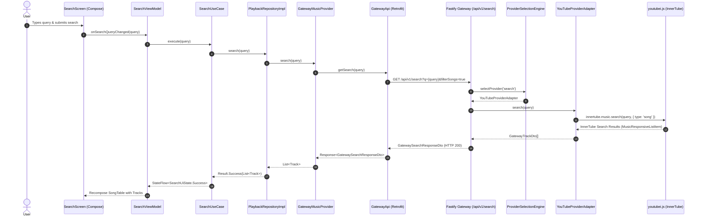
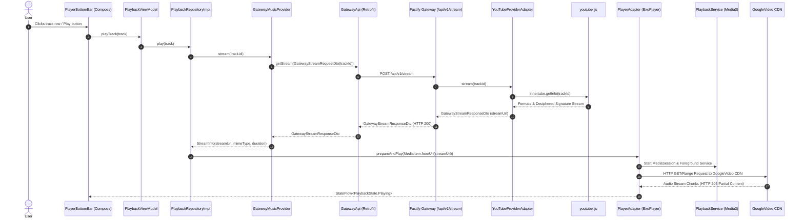

# CliBeats Complete End-to-End Integration Map

This document traces the complete execution flow from the user's touch action in the Android Jetpack Compose UI down to the Fastify Gateway server, InnerTube extraction, GoogleVideo CDN resolution, and Media3 ExoPlayer playback.

---

## 1. End-to-End Search Integration Map



### Component Details for Search

| Layer | Component Class | Package / File Path | Responsibility |
| :--- | :--- | :--- | :--- |
| **UI** | `SearchScreen` | `com.clibeats.ui.search.SearchScreen` | Renders TUI search input, loading indicators, and song results table. |
| **ViewModel** | `SearchViewModel` | `com.clibeats.ui.search.SearchViewModel` | Manages UI state flow (`SearchUiState`), debounces search input, handles user selection. |
| **Domain UseCase** | `SearchUseCase` | `com.clibeats.domain.usecase.SearchUseCase` | Encapsulates business logic for querying tracks. |
| **Repository** | `PlaybackRepositoryImpl` | `com.clibeats.data.repository.PlaybackRepositoryImpl` | Implements `MusicRepository`, manages local cache fallback and delegates to `MusicProvider`. |
| **DI Binding** | `ProviderModule` | `com.clibeats.di.ProviderModule` | Binds `GatewayMusicProvider` to `MusicProvider` interface using `@Singleton`. |
| **Gateway Provider** | `GatewayMusicProvider` | `com.clibeats.data.gateway.GatewayMusicProvider` | Translates Android domain calls to Retrofit DTO requests; maps errors via `GatewayErrorMapper`. |
| **Retrofit Client** | `GatewayApi` | `com.clibeats.data.gateway.api.GatewayApi` | Retrofit interface defining REST endpoints (`/api/v1/search`, `/api/v1/stream`, etc.). |
| **Network Client** | `NetworkModule` | `com.clibeats.di.NetworkModule` | Supplies `OkHttpClient` with timeout rules and trace ID interceptors using `BuildConfig.GATEWAY_BASE_URL`. |
| **Gateway Server** | `app.ts` | `gateway/src/app.ts` | Fastify REST application initialization, schema validation, and route dispatching. |
| **Selection Engine** | `ProviderSelectionEngine` | `gateway/src/core/selection/ProviderSelectionEngine.ts` | Evaluates circuit breaker state and provider health scores to select active provider. |
| **YouTube Adapter** | `YouTubeProviderAdapter` | `gateway/src/providers/youtube/YouTubeProviderAdapter.ts` | Server-side YouTube extraction using `youtubei.js`. |
| **InnerTube Engine** | `youtubei.js` | `gateway/node_modules/youtubei.js` | Parses YouTube Music API responses and extracts structured track metadata. |

---

## 2. End-to-End Stream Resolution & Playback Map



### Component Details for Playback Engine

| Layer | Component Class | Package / File Path | Responsibility |
| :--- | :--- | :--- | :--- |
| **Player Adapter** | `PlayerAdapter` | `com.clibeats.playback.PlayerAdapter` | Wraps AndroidX Media3 `ExoPlayer` instance; handles queue state, events, and transitions. |
| **Media Service** | `PlaybackService` | `com.clibeats.playback.service.PlaybackService` | AndroidX `MediaSessionService` providing system notifications, media session controls, and background service lifecycle. |
| **Logger / Diagnostics** | `StructuredLogger` | `com.clibeats.playback.StructuredLogger` | Emits structured JSON diagnostics for player state transitions and stream performance. |
| **Error Mapper** | `GatewayErrorMapper` | `com.clibeats.data.gateway.mapper.GatewayErrorMapper` | Translates HTTP 404/429/500 and network connection failures into domain `CliBeatsException`. |

---

## 3. Data Model & DTO Mapping Chain

1. **InnerTube Raw JSON** (`youtubei.js` `MusicResponsiveListItem`)
   $$\downarrow$$
2. **Gateway Track DTO** (`gateway/src/types/provider.ts` $\rightarrow$ `GatewayTrackDto`)
   ```json
   {
     "id": "dQw4w9WgXcQ",
     "providerId": "youtube",
     "title": "Never Gonna Give You Up",
     "artist": "Rick Astley",
     "album": "Whenever You Need Somebody",
     "durationSeconds": 213,
     "artworkUrl": "https://lh3.googleusercontent.com/..."
   }
   ```
   $$\downarrow$$
3. **Android Retrofit DTO** (`GatewayTrackDto.kt`)
   $$\downarrow$$
4. **Gateway Track Mapper** (`GatewayTrackMapper.kt`)
   $$\downarrow$$
5. **Android Domain Model** (`com.clibeats.domain.model.Track`)
   ```kotlin
   data class Track(
       val id: String,
       val title: String,
       val artist: String,
       val album: String,
       val durationMs: Long,
       val artworkUrl: String?,
       val isCached: Boolean = false
   )
   ```
